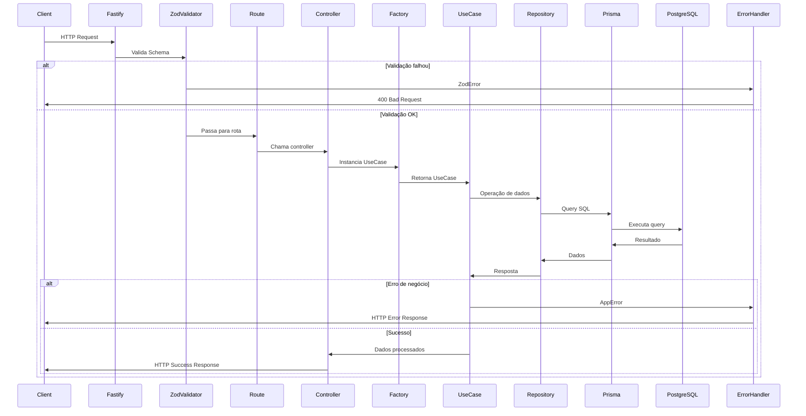
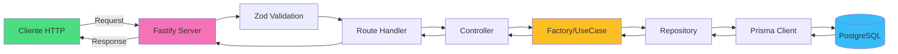

# Fluxo Completo da Aplicação IAM Service

> [!NOTE]
> Este diagrama mostra **ABSOLUTAMENTE TODO** o fluxo da aplicação IAM (Identity & Access Management), desde a inicialização do servidor até cada endpoint, camada de arquitetura, validações, autenticação e integração com o banco de dados.

---

## 🏗️ Arquitetura da Aplicação

A aplicação segue os princípios da **Clean Architecture**, com camadas bem definidas:

- **Camada HTTP (Infra)**: Controllers, Routes, Middlewares, Error Handlers
- **Camada de Domínio (Modules)**: Use Cases, Repositories, DTOs
- **Camada Core**: Erros customizados e regras de negócio
- **Camada de Dados**: Prisma ORM + PostgreSQL

---

## 📊 Diagrama Completo do Fluxo

```mermaid
graph TB
    %% ============================================
    %% INICIALIZAÇÃO DA APLICAÇÃO
    %% ============================================
    START([Aplicação Inicia]) --> SERVER[server.ts]
    SERVER --> APP_INIT[app.ts - Inicialização]
    
    APP_INIT --> FASTIFY[Cria Instância Fastify]
    FASTIFY --> PLUGINS[Registra Plugins]
    
    %% Plugins
    PLUGINS --> COOKIE[Cookie Plugin<br/>secret config]
    PLUGINS --> JWT_PLUGIN[JWT Plugin<br/>Access: 10min<br/>Refresh: 7 dias]
    PLUGINS --> SWAGGER_PLUGIN[Swagger + UI<br/>/docs endpoint]
    PLUGINS --> ZOD_PLUGIN[Zod Type Provider<br/>Validação automática]
    
    %% Hooks e configurações
    PLUGINS --> HOOKS[Hooks e Middlewares]
    HOOKS --> ON_RESPONSE[onResponse Hook<br/>Log de requisições]
    HOOKS --> ERROR_HANDLER[Error Handler Global]
    
    %% Registro de rotas
    HOOKS --> ROUTES[Registro de Rotas]
    ROUTES --> ROUTE_CREATE[POST /users]
    ROUTES --> ROUTE_AUTH[POST /sessions]
    ROUTES --> ROUTE_PROFILE[GET /me]
    ROUTES --> ROUTE_REFRESH[PATCH /token/refresh]
    
    ROUTES --> LISTEN[app.listen<br/>Host: 0.0.0.0<br/>Porta: env.PORT]
    LISTEN --> READY([Servidor Rodando])
    
    %% ============================================
    %% FLUXO 1: CRIAÇÃO DE USUÁRIO
    %% ============================================
    READY --> REQ1[Cliente faz requisição<br/>POST /users]
    
    REQ1 --> ZOD_VAL1[Zod Schema Validation<br/>name, email, password]
    ZOD_VAL1 -->|Inválido| ERR_ZOD1[ZodError 400]
    ZOD_VAL1 -->|Válido| CONTROLLER1[createUserController]
    
    CONTROLLER1 --> FACTORY1[makeCreateUserUseCase<br/>Factory Pattern]
    FACTORY1 --> REPO1[PrismaUsersRepository<br/>instância]
    REPO1 --> USECASE1[CreateUserUseCase]
    
    USECASE1 --> CHECK_EMAIL[findByEmail<br/>verifica duplicação]
    CHECK_EMAIL -->|Existe| ERR_EXISTS[UserAlreadyExistsError<br/>409 Conflict]
    CHECK_EMAIL -->|Não existe| HASH_PASS[bcrypt.hash<br/>10 rounds]
    
    HASH_PASS --> DB_CREATE[prisma.user.create<br/>INSERT no PostgreSQL]
    DB_CREATE --> RESP1[Response 201<br/>user sem password_hash]
    
    %% ============================================
    %% FLUXO 2: AUTENTICAÇÃO
    %% ============================================
    READY --> REQ2[Cliente faz requisição<br/>POST /sessions]
    
    REQ2 --> ZOD_VAL2[Zod Schema Validation<br/>email, password]
    ZOD_VAL2 -->|Inválido| ERR_ZOD2[ZodError 400]
    ZOD_VAL2 -->|Válido| CONTROLLER2[authenticateController]
    
    CONTROLLER2 --> FACTORY2[makeAuthenticateUserUseCase<br/>Factory Pattern]
    FACTORY2 --> REPO2[PrismaUsersRepository<br/>instância]
    REPO2 --> USECASE2[AuthenticateUserUseCase]
    
    USECASE2 --> FIND_USER[findByEmail<br/>busca no DB]
    FIND_USER -->|Não existe| ERR_CRED1[InvalidCredentialsError<br/>401]
    FIND_USER -->|Existe| COMPARE_PASS[bcrypt.compare<br/>valida senha]
    
    COMPARE_PASS -->|Inválida| ERR_CRED2[InvalidCredentialsError<br/>401]
    COMPARE_PASS -->|Válida| GEN_TOKENS[Gera Tokens JWT]
    
    GEN_TOKENS --> ACCESS_TOKEN[Access Token<br/>payload: role<br/>sub: userId<br/>exp: 10min]
    GEN_TOKENS --> REFRESH_TOKEN[Refresh Token<br/>payload: vazio<br/>sub: userId<br/>exp: 7 dias]
    
    REFRESH_TOKEN --> SET_COOKIE[setCookie refreshToken<br/>httpOnly, secure, sameSite]
    SET_COOKIE --> RESP2[Response 200<br/>access token no body]
    
    %% ============================================
    %% FLUXO 3: OBTER PERFIL (ROTA PROTEGIDA)
    %% ============================================
    READY --> REQ3[Cliente faz requisição<br/>GET /me<br/>Header: Authorization Bearer token]
    
    REQ3 --> MIDDLEWARE_JWT[verifyJWT Middleware<br/>onRequest hook]
    MIDDLEWARE_JWT --> JWT_VERIFY[request.jwtVerify]
    JWT_VERIFY -->|Token inválido/expirado| ERR_UNAUTH[401 Unauthorized]
    JWT_VERIFY -->|Token válido| DECODE_JWT[Decodifica JWT<br/>extrai userId do sub]
    
    DECODE_JWT --> CONTROLLER3[getProfileController]
    CONTROLLER3 --> FACTORY3[makeGetUserProfileUseCase<br/>Factory Pattern]
    FACTORY3 --> REPO3[PrismaUsersRepository<br/>instância]
    REPO3 --> USECASE3[GetUserProfileUseCase]
    
    USECASE3 --> FIND_BY_ID[findById<br/>busca no DB]
    FIND_BY_ID -->|Não encontrado| ERR_NOT_FOUND[ResourceNotFoundError<br/>404]
    FIND_BY_ID -->|Encontrado| RESP3[Response 200<br/>user: id, name, email, role]
    
    %% ============================================
    %% FLUXO 4: REFRESH TOKEN
    %% ============================================
    READY --> REQ4[Cliente faz requisição<br/>PATCH /token/refresh<br/>Cookie: refreshToken]
    
    REQ4 --> REFRESH_CTRL[refresh controller inline]
    REFRESH_CTRL --> VERIFY_COOKIE[request.jwtVerify<br/>onlyCookie: true]
    VERIFY_COOKIE -->|Inválido| ERR_REFRESH[InvalidRefreshTokenError<br/>401]
    VERIFY_COOKIE -->|Válido| EXTRACT_SUB[Extrai userId do sub]
    
    EXTRACT_SUB --> NEW_ACCESS[Novo Access Token<br/>exp: 10min]
    EXTRACT_SUB --> NEW_REFRESH[Novo Refresh Token<br/>exp: 7 dias]
    
    NEW_REFRESH --> SET_COOKIE2[setCookie refreshToken<br/>httpOnly, secure, sameSite]
    SET_COOKIE2 --> RESP4[Response 200<br/>novo access token]
    
    %% ============================================
    %% CAMADA DE DADOS E ERROS
    %% ============================================
    DB_CREATE --> POSTGRES[(PostgreSQL Database<br/>Tabela: users)]
    FIND_USER --> POSTGRES
    FIND_BY_ID --> POSTGRES
    
    ERR_ZOD1 --> ERROR_HANDLER
    ERR_EXISTS --> ERROR_HANDLER
    ERR_ZOD2 --> ERROR_HANDLER
    ERR_CRED1 --> ERROR_HANDLER
    ERR_CRED2 --> ERROR_HANDLER
    ERR_UNAUTH --> ERROR_HANDLER
    ERR_NOT_FOUND --> ERROR_HANDLER
    ERR_REFRESH --> ERROR_HANDLER
    
    ERROR_HANDLER --> CHECK_ERROR{Tipo de Erro?}
    CHECK_ERROR -->|ZodError| FORMAT_ZOD[400 Bad Request<br/>z.treeifyError]
    CHECK_ERROR -->|AppError| FORMAT_APP[Retorna statusCode e message<br/>do erro customizado]
    CHECK_ERROR -->|Outro| FORMAT_GENERIC[500 Internal Server Error<br/>+ log em dev]
    
    %% ============================================
    %% ESQUEMA DO BANCO
    %% ============================================
    POSTGRES --> SCHEMA[Schema Prisma]
    SCHEMA --> USER_MODEL[User Model:<br/>id: UUID<br/>email: String unique<br/>name: String?<br/>password_hash: String<br/>role: Enum ADMIN/MEMBER<br/>createdAt: DateTime<br/>updatedAt: DateTime]
    
    %% Estilos
    classDef startEnd fill:#4ade80,stroke:#22c55e,stroke-width:3px,color:#000
    classDef server fill:#60a5fa,stroke:#3b82f6,stroke-width:2px,color:#000
    classDef route fill:#f472b6,stroke:#ec4899,stroke-width:2px,color:#000
    classDef controller fill:#a78bfa,stroke:#8b5cf6,stroke-width:2px,color:#000
    classDef usecase fill:#fbbf24,stroke:#f59e0b,stroke-width:2px,color:#000
    classDef repo fill:#34d399,stroke:#10b981,stroke-width:2px,color:#000
    classDef error fill:#f87171,stroke:#ef4444,stroke-width:2px,color:#000
    classDef db fill:#38bdf8,stroke:#0ea5e9,stroke-width:3px,color:#000
    classDef middleware fill:#fb923c,stroke:#f97316,stroke-width:2px,color:#000
    
    class START,READY,REQ1,REQ2,REQ3,REQ4 startEnd
    class SERVER,APP_INIT,FASTIFY,PLUGINS,LISTEN server
    class ROUTE_CREATE,ROUTE_AUTH,ROUTE_PROFILE,ROUTE_REFRESH route
    class CONTROLLER1,CONTROLLER2,CONTROLLER3,REFRESH_CTRL controller
    class USECASE1,USECASE2,USECASE3 usecase
    class REPO1,REPO2,REPO3 repo
    class ERR_ZOD1,ERR_EXISTS,ERR_ZOD2,ERR_CRED1,ERR_CRED2,ERR_UNAUTH,ERR_NOT_FOUND,ERR_REFRESH,ERROR_HANDLER error
    class POSTGRES,SCHEMA,USER_MODEL db
    class MIDDLEWARE_JWT,VERIFY_COOKIE,JWT_VERIFY middleware
```



---

## 🔐 Detalhes de Segurança

### JWT Strategy
- **Access Token**: 10 minutos de validade, enviado no body, contém `role` e `userId` (sub)
- **Refresh Token**: 7 dias de validade, armazenado em **httpOnly cookie** (protegido contra XSS)
- **Secret**: Configurado via variável de ambiente `JWT_SECRET`

### Password Hashing
- **Algoritmo**: bcrypt
- **Salt Rounds**: 10
- **Nunca retorna** `password_hash` nas responses

### Cookies
- `httpOnly`: true (não acessível via JavaScript)
- `secure`: true (só HTTPS em produção)
- `sameSite`: true (proteção CSRF)

---

## 🗄️ Modelo de Dados (Prisma)

```prisma
model User {
  id            String   @id @default(uuid())
  email         String   @unique
  name          String?
  password_hash String
  role          Role     @default(MEMBER)
  createdAt     DateTime @default(now())
  updatedAt     DateTime @updatedAt

  @@map("users")
}

enum Role {
  ADMIN
  MEMBER
}
```

---

## 📡 Endpoints API

| Método | Rota | Descrição | Autenticação | Body |
|--------|------|-----------|--------------|------|
| **POST** | `/users` | Criar novo usuário | ❌ Não | `{ name?, email, password }` |
| **POST** | `/sessions` | Autenticar usuário | ❌ Não | `{ email, password }` |
| **GET** | `/me` | Obter perfil do usuário autenticado | ✅ Sim | - |
| **PATCH** | `/token/refresh` | Renovar access token | ✅ Cookie | - |
| **GET** | `/docs` | Documentação Swagger | ❌ Não | - |

---

## 🧩 Padrões de Projeto Utilizados

### 1. **Factory Pattern**
```typescript
// Exemplo: makeCreateUserUseCase
export function makeCreateUserUseCase() {
  const usersRepository = new PrismaUsersRepository()
  return new CreateUserUseCase(usersRepository)
}
```
**Benefício**: Centraliza a criação de dependências, facilita testes

### 2. **Repository Pattern**
```typescript
interface IUsersRepository {
  create(data: Prisma.UserCreateInput): Promise<User>
  findByEmail(email: string): Promise<User | null>
  findById(id: string): Promise<User | null>
}
```
**Benefício**: Abstrai a camada de dados, permite trocar ORM facilmente

### 3. **Dependency Injection**
```typescript
export class CreateUserUseCase {
  constructor(private userRepository: IUsersRepository) {}
  // ...
}
```
**Benefício**: Desacoplamento, testabilidade (mocks)

### 4. **Custom Error Classes**
```typescript
export class UserAlreadyExistsError extends AppError {
  constructor() {
    super('User already exists.', 409)
  }
}
```
**Benefício**: Erros tipados, tratamento centralizado

---

## 🔄 Ciclo de Vida de uma Requisição



---

## 🧪 Testes

A aplicação possui:
- **Unit Tests**: Use Cases com repository in-memory
- **E2E Tests**: Controllers com banco de teste

```bash
# Testes unitários
npm test

# Testes E2E
npm run test:e2e
```

---

## 🚀 Deploy e Infraestrutura

### Docker
```yaml
# docker-compose.yml
services:
  postgres:
    image: postgres:latest
    environment:
      POSTGRES_DB: iam
      POSTGRES_USER: user
      POSTGRES_PASSWORD: pass
    ports:
      - "5432:5432"
```

### Dockerfile
```dockerfile
FROM node:22-alpine
WORKDIR /app
COPY package*.json ./
RUN npm install
COPY . .
RUN npx prisma generate
CMD ["npm", "run", "dev"]
```

---

## 📚 Stack Tecnológico Completa

| Categoria | Tecnologia | Versão | Finalidade |
|-----------|------------|--------|------------|
| **Runtime** | Node.js | v22+ | Execução JavaScript |
| **Framework** | Fastify | ^5.6.2 | Web server de alta performance |
| **Linguagem** | TypeScript | ^5.9.3 | Type safety |
| **ORM** | Prisma | ^7.2.0 | Database toolkit |
| **Database** | PostgreSQL | latest | Banco de dados relacional |
| **Validação** | Zod | ^4.2.1 | Schema validation |
| **Autenticação** | @fastify/jwt | ^10.0.0 | JWT tokens |
| **Segurança** | bcrypt | ^6.0.0 | Password hashing |
| **Cookies** | @fastify/cookie | ^11.0.2 | Cookie management |
| **Documentação** | Swagger + UI | ^9.6.1 / ^5.2.3 | API documentation |
| **Testes** | Vitest | ^4.0.16 | Testing framework |
| **Dev Server** | tsx | ^4.21.0 | Hot reload development |

---

## 🎯 Fluxo de Dados Resumido



---

## ✅ Checklist de Funcionalidades

- [x] Registro de usuário com validação de email único
- [x] Hash de senha com bcrypt (10 rounds)
- [x] Autenticação via email/senha
- [x] Geração de JWT tokens (Access + Refresh)
- [x] Refresh token em httpOnly cookie
- [x] Middleware de autenticação JWT
- [x] Rota protegida para obter perfil
- [x] Endpoint de renovação de token
- [x] Tratamento centralizado de erros
- [x] Validação de schemas com Zod
- [x] Documentação Swagger automática
- [x] Sistema de roles (ADMIN/MEMBER)
- [x] Clean Architecture
- [x] Repository Pattern
- [x] Factory Pattern
- [x] Testes unitários e E2E
- [x] Docker + Docker Compose
- [x] Variáveis de ambiente

---

## 🔮 Próximas Funcionalidades (Potencial)

- [ ] Middleware de autorização por role (ADMIN only)
- [ ] Email verification
- [ ] Password reset flow
- [ ] Rate limiting
- [ ] Refresh token rotation
- [ ] Revogação de tokens (blacklist)
- [ ] Auditoria de login
- [ ] 2FA (Two-Factor Authentication)
- [ ] OAuth2/Social login
- [ ] RBAC completo (Permissions)

---

**Documentação gerada para o projeto IAM Service - Clean Architecture com Fastify, TypeScript, Prisma e PostgreSQL** 🚀
