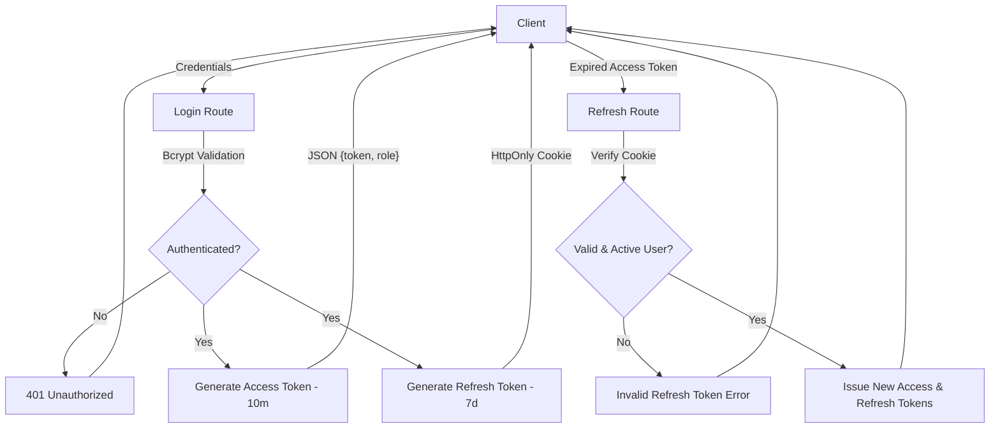

# Identity & Access Management (IAM) Service

> **Status:** Stable Core / Architecture-Focused Prototype
> _Developed as a foundational microservice for centralized authentication and authorization._

## Objective

This service is a high-standard implementation of an **Identity and Access Management (IAM)** system. It was designed to serve as a decoupled authentication hub for a specific ecosystem, applying **Clean Architecture** to ensure that business rules (Use Cases) remain independent of infrastructure (Fastify, Prisma, etc.).

The primary goal of this repository is to demonstrate mastery over **API Security**, **E2E Testing**, and **Software Design Patterns** within a modern Node.js ecosystem.

## Tech Stack

- **Runtime:** Node.js v22.19+ (Native `--env-file` support)
- **Framework:** Fastify (High-performance with Zod Type Provider)
- **Language:** TypeScript
- **ORM:** Prisma (PostgreSQL)
- **Security:** Bcrypt (Password hashing), JWT (Stateless Auth), and Secure Cookies
- **Testing:** Vitest (Full End-to-End Specs)

## System Flow

## Key Features (Already Implemented)

- **Decoupled Architecture:** Strict separation between Routes, Controllers, and Use Cases.
- **RBAC (Role-Based Access Control):** Differentiated access levels for `ADMIN` and `MEMBER` roles.
- **Session Management:** Stateless authentication using JWT with a secure Refresh Token flow via `httpOnly` and `sameSite` cookies.
- **Data Integrity:** Schema-based validation using Zod at the application's edge.
- **E2E Testing Suite:** Automated validation of the entire lifecycle, from HTTP request to database persistence.

## Architectural Trade-offs & Security Notes

To maintain a scalable, stateless microservice, the following design choices were made:

1. **Stateless JWT & Revocation:** The system uses stateless JWTs for maximum performance. Session revocation is currently handled by the short expiration of the Access Token (10m) and the manual deletion/invalidation of the Refresh Token in the database.
2. **Roadmap for Production Hardening:** In a high-stakes production environment, the following enhancements are mapped:
   - **Refresh Token Rotation:** Implementing token chaining to detect and mitigate token theft.
   - **Redis Integration:** Implementation of a real-time JWT blacklist for immediate session revocation.
   - **Rate Limiting:** Protection against brute-force attacks on sensitive endpoints.

## How to Run

### Prerequisites

- Node.js v22 or higher (Uses native --env-file support)
- Docker and Docker Compose

### Installation

1. Clone the repository:
   git clone <your-repository-url>
   cd iam-service
   npm install

2. Environment Setup:
   Create a .env file in the root directory and configure your DATABASE_URL and JWT_SECRET.

3. Database Migration:
   npx prisma migrate dev

4. Start the server:
   npm run dev

---

Developed with focus on software quality and security best practices.
